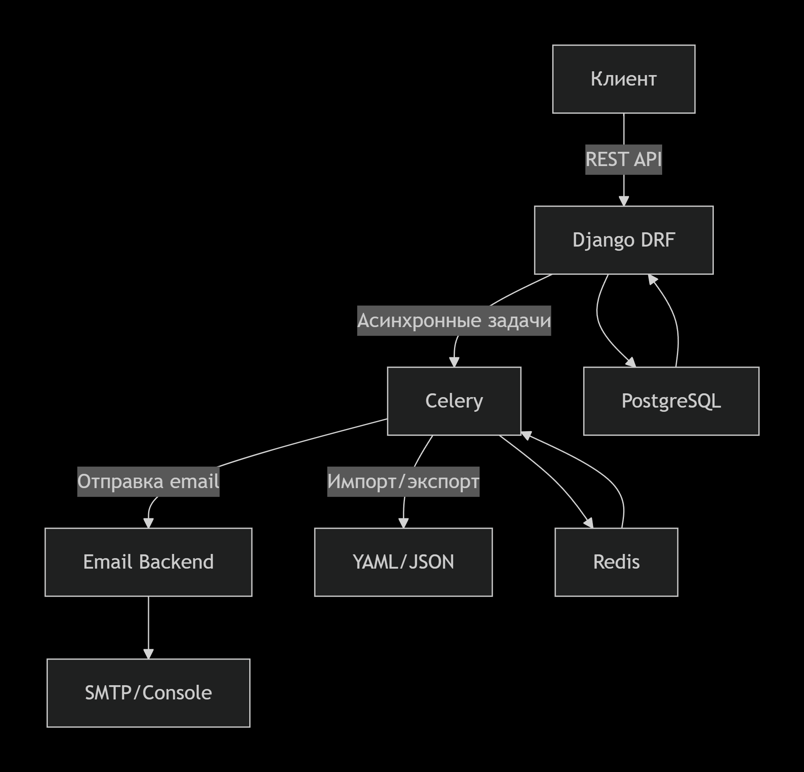
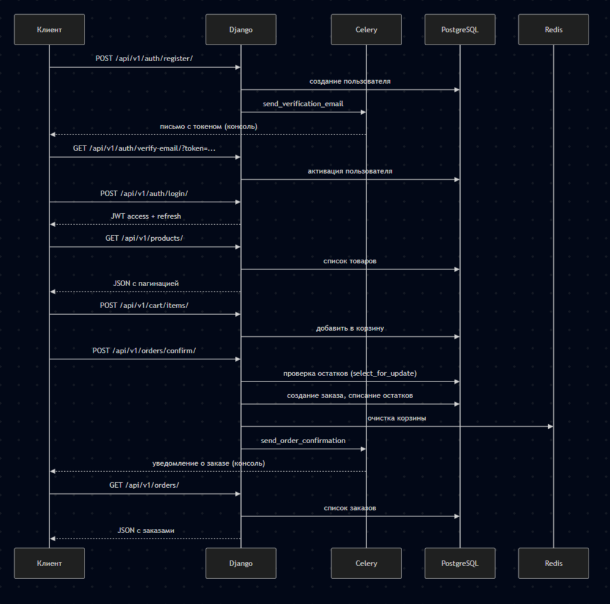
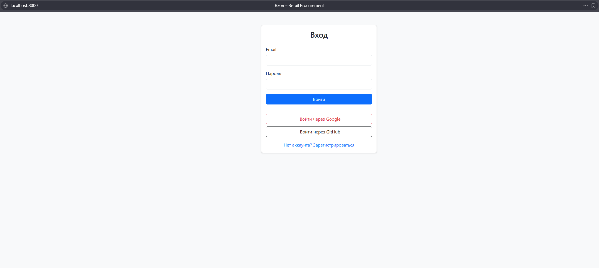
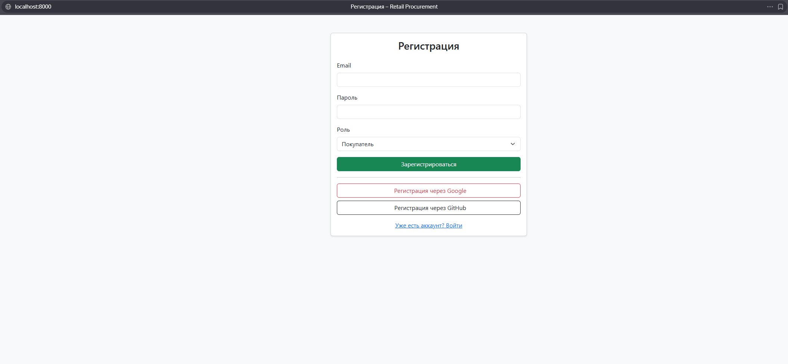
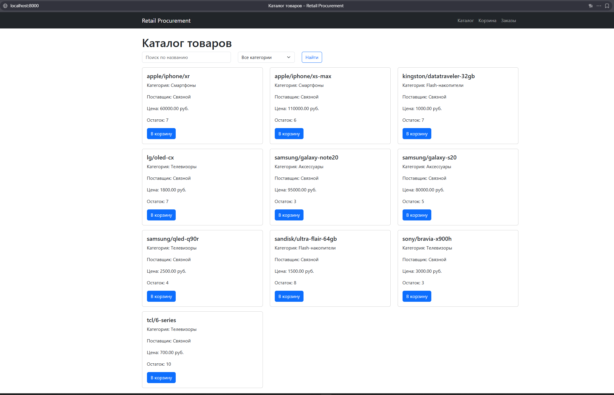
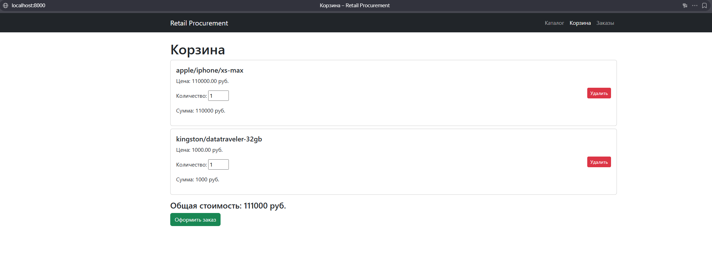
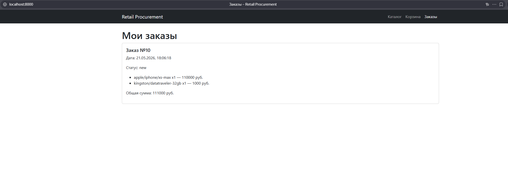

# 🛒 Retail Procurement API

> **Дипломный проект** в рамках расширенного курса «Python‑разработчик» от [Нетологии](https://netology.ru/)

Backend‑приложение для автоматизации закупок в розничной сети

[](https://www.djangoproject.com/)
[](https://www.django-rest-framework.org/)
[](https://docs.celeryq.dev)
[](https://redis.io)
[](https://www.docker.com/)
[](https://www.postgresql.org/)

---

## 📑 Содержание

- [✨ Возможности](#-возможности)
- [🏗️ Архитектура](#️-архитектура)
- [🔄 Процесс заказа](#-процесс-заказа)
- [🖥️ Интерфейс](#️-интерфейс)
- [🧰 Технологический стек](#-технологический-стек)
- [📦 Быстрый старт](#-быстрый-старт)
- [📡 API Endpoints](#-api-endpoints)
- [🧪 Тестирование](#-тестирование)
- [📁 Структура проекта](#-структура-проекта)
- [🚧 Дальнейшее развитие](#-дальнейшее-развитие)
- [👤 Автор](#-автор)

---

## ✨ Возможности

- **Регистрация и авторизация** по JWT (Simple JWT)
- **Каталог товаров** с фильтрацией по категории, поставщику, цене и поиском
- **Корзина** с добавлением, изменением количества и удалением товаров
- **Оформление заказа** с адресом доставки
- **Личный кабинет поставщика**: просмотр своих заказов, включение/отключение приёма заказов
- **Импорт товаров** из YAML‑файла через management‑команду и асинхронную Celery‑задачу
- **Email‑уведомления** о регистрации и подтверждении заказа (через Celery, backend – консоль)
- **Администрирование**: изменение статуса заказа с уведомлением клиента, экспорт товаров в CSV
- **Полная контейнеризация** Docker Compose (PostgreSQL, Redis, Celery worker, Django)
- **Автоматическая документация API** – Swagger UI и ReDoc через `drf-spectacular`
- **Фронтенд** на Bootstrap 5 (каталог, корзина, заказы, регистрация и логин)

---

## 🏗️ Архитектура
 

---

## 🔄 Процесс заказа

 

---

## 🖥️ Интерфейс

<!-- Добавить скриншот: страница входа (login.html) -->

 




---

## 🧰 Технологический стек

| Слой | Инструменты |
|------|------------|
| **Backend** | Python 3.10, Django 4.2, Django REST Framework |
| **Базы данных** | PostgreSQL, Redis |
| **Асинхронность** | Celery, Redis (брокер) |
| **Аутентификация** | Simple JWT |
| **Контейнеризация** | Docker, Docker Compose |
| **Тестирование** | pytest, factory-boy |
| **Документация** | drf-spectacular (Swagger UI, ReDoc) |
| **Фронтенд** | HTML5, CSS3, Bootstrap 5, JavaScript (fetch API) |

---

## 📦 Быстрый старт

### 1. Клонирование репозитория
```bash
git clone https://github.com/bsekinaev/retail-procurement.git
cd retail-procurement
```

### 2. Настройка окружения
Создайте файл `.env` в корне проекта по примеру `.env.example`:

```
SECRET_KEY=ваш_секретный_ключ
DEBUG=True
ALLOWED_HOSTS=localhost,127.0.0.1
DB_NAME=orders_db
DB_USER=postgres
DB_PASSWORD=postgres
DB_HOST=db
DB_PORT=5432
REDIS_HOST=redis
REDIS_PORT=6379
```

### 3. Запуск с Docker
```bash
docker-compose up --build -d
```

Приложение будет доступно по адресу [http://localhost:8000](http://localhost:8000).  
Фронтенд откроется автоматически на главной странице.

### 4. Импорт тестовых товаров
```bash
docker-compose exec web python manage.py import_products shop1.yaml
```

### 5. Документация API
Swagger UI: [http://localhost:8000/api/v1/docs/](http://localhost:8000/api/v1/docs/)  
ReDoc: [http://localhost:8000/api/v1/redoc/](http://localhost:8000/api/v1/redoc/)

---

## 📡 API Endpoints

### 🔐 Авторизация
| Метод | Путь | Описание | Аутентификация |
|-------|------|----------|---------------|
| `POST` | `/api/v1/auth/register/` | Регистрация покупателя/поставщика | Нет |
| `POST` | `/api/v1/auth/login/` | Вход (получение JWT access/refresh) | Нет |
| `POST` | `/api/v1/auth/token/refresh/` | Обновление access‑токена | Нет |
| `GET` | `/api/v1/auth/verify-email/?token=` | Подтверждение email | Нет |

### 📦 Товары и каталог
| Метод | Путь | Описание | Аутентификация |
|-------|------|----------|---------------|
| `GET` | `/api/v1/products/` | Список товаров (фильтры, поиск) | Да |
| `GET` | `/api/v1/products/{id}/` | Детали товара с характеристиками | Да |

### 🛒 Корзина
| Метод | Путь | Описание | Аутентификация |
|-------|------|----------|---------------|
| `GET` | `/api/v1/cart/` | Содержимое корзины | Да |
| `POST` | `/api/v1/cart/items/` | Добавить товар в корзину | Да |
| `PATCH` | `/api/v1/cart/items/{id}/` | Изменить количество товара | Да |
| `DELETE` | `/api/v1/cart/items/{id}/delete/` | Удалить позицию из корзины | Да |

### 📋 Заказы
| Метод | Путь | Описание | Аутентификация |
|-------|------|----------|---------------|
| `POST` | `/api/v1/orders/confirm/` | Подтвердить заказ | Да |
| `GET` | `/api/v1/orders/` | Список заказов пользователя | Да |
| `GET` | `/api/v1/orders/{id}/` | Детали заказа | Да |

### 🚚 Поставщики
| Метод | Путь | Описание | Аутентификация |
|-------|------|----------|---------------|
| `GET` | `/api/v1/supplier/orders/` | Заказы с товарами поставщика | Да (поставщик) |
| `PUT` | `/api/v1/supplier/status/` | Включение/отключение приёма заказов | Да (поставщик) |
| `POST` | `/api/v1/supplier/import/` | Асинхронный импорт товаров (Celery) | Да (админ) |

### 🔧 Администратор
| Метод | Путь | Описание | Аутентификация |
|-------|------|----------|---------------|
| `PATCH` | `/api/v1/admin/orders/{id}/` | Изменить статус заказа | Да (админ) |
| `GET` | `/api/v1/admin/export/csv/` | Экспорт товаров в CSV | Да (админ) |


**Примеры запросов:**
```bash
# Регистрация
curl -X POST http://localhost:8000/api/v1/auth/register/ \
  -H "Content-Type: application/json" \
  -d '{"email":"user@example.com","password":"testpass123","user_type":"client"}'

# Вход
curl -X POST http://localhost:8000/api/v1/auth/login/ \
  -H "Content-Type: application/json" \
  -d '{"email":"user@example.com","password":"testpass123"}'

# Список товаров (требуется access‑токен)
curl -H "Authorization: Bearer <access_token>" http://localhost:8000/api/v1/products/

# Добавление в корзину
curl -X POST http://localhost:8000/api/v1/cart/items/ \
  -H "Authorization: Bearer <access_token>" \
  -H "Content-Type: application/json" \
  -d '{"product_id":1, "quantity":2}'
```

---

## 🧪 Тестирование

Для запуска тестов:

```bash
docker-compose exec web pytest
```

В проекте реализован интеграционный тест полного цикла покупки.  
CI/CD (GitHub Actions) автоматически прогоняет тесты при каждом пуше в `main`.

---

## 📁 Структура проекта

```
retail-procurement/
├── api/                   # Основные эндпоинты, Celery-задачи email
├── cart/                  # Модель корзины, сериализаторы, views
├── doc/                   # Документация и схемы (архитектура, скриншоты)
├── frontend/              # Фронтенд на Bootstrap 
├── orders_app/            # Заказы, контакты, сериализаторы, views
├── orders/                # Настройки Django
├── products/              # Товары, категории, импорт, Celery-задачи
├── suppliers/             # Поставщики, views
├── users/                 # Кастомная модель User, сериализатор регистрации
├── static/                # Статические файлы
├── celery_worker.py       # Конфигурация Celery
├── docker-compose.yml
├── Dockerfile
├── entrypoint.sh
├── manage.py
├── requirements.txt
├── .env.example
└── README.md
```

---

## 🚧 Дальнейшее развитие

- [x] Подключить Swagger‑документацию (`drf-spectacular`)
- [x] Добавить эндпоинт подтверждения email (верификация)
- [x] Админский эндпоинт смены статуса заказа с уведомлением клиента
- [x] Экспорт товаров в CSV
- [x] GitHub Actions для CI
- [x] Фронтенд на Bootstrap
- [x] Сервисный слой для корзины и заказов
- [x] Тесты (auth, cart, orders, products)
- [ ] Кэширование каталога через Redis
- [ ] Мониторинг и логирование

> **Примечание по безопасности:** В учебных целях JWT-токен хранится в `localStorage`.
> 
> Для production‑среды рекомендуется использовать HttpOnly cookies для защиты от XSS.

---

## 👤 Автор

**Батраз Секинаев**  
Python Backend Developer

- 📧 [bsekinaev@ya.ru](bsekinaev@ya.ru)
- 📢 Telegram: [@bsekinaev](https://t.me/bsekinaev)  
- ⭐️ GitHub: [bsekinaev](https://github.com/bsekinaev)
