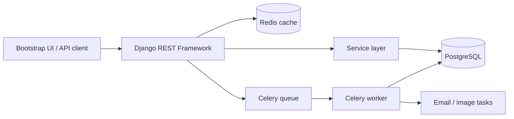

# Retail Procurement API

> Дипломный проект расширенного курса «Python-разработчик» в Нетологии.

[](https://www.djangoproject.com/)
[](https://www.django-rest-framework.org/)


[](https://github.com/bsekinaev/retail-procurement/actions)

Backend-приложение для автоматизации закупок между покупателями и поставщиками. Проект включает каталог, корзину, оформление заказов, импорт прайс-листов, роли пользователей и фоновые задачи.

## Основные возможности

- регистрация и JWT-аутентификация;
- вход через Google и GitHub OAuth2;
- каталог товаров с фильтрацией и поиском;
- Redis-кэширование каталога;
- корзина и оформление заказа;
- атомарная проверка и списание остатков;
- роли покупателя, поставщика и администратора;
- асинхронный импорт YAML-прайсов через Celery;
- email-уведомления и обработка изображений в фоне;
- Swagger UI и ReDoc;
- Bootstrap-интерфейс для основных пользовательских сценариев;
- pytest-django и GitHub Actions.

## Ключевые инженерные решения

### Транзакционное оформление заказа

Оформление заказа вынесено в сервисный слой. Для защиты остатков при конкурентных запросах используются `transaction.atomic` и `select_for_update`.

### Фоновые операции

Импорт прайс-листов, email-уведомления и обработка изображений выполняются через Celery, чтобы длительные операции не блокировали HTTP-запрос.

### Аутентификация

Проект поддерживает JWT, подтверждение email и OAuth2-вход через Google и GitHub.

### Кэширование

Redis используется для кэширования каталога. Инвалидация выполняется при изменении данных, влияющих на выдачу.

## Архитектура



## Технологический стек

| Область | Технологии |
|---|---|
| Backend | Python 3.10, Django 4.2, Django REST Framework |
| Database | PostgreSQL, Django ORM |
| Cache / queue | Redis, Celery |
| Auth | Simple JWT, Google OAuth2, GitHub OAuth |
| Tests | pytest, pytest-django, factory-boy |
| API docs | drf-spectacular, Swagger UI, ReDoc |
| Infrastructure | Docker, Docker Compose, GitHub Actions |
| Frontend | HTML, Bootstrap 5, JavaScript |
| Error tracking | Glitchtip / Sentry-compatible SDK |

## Быстрый старт

### 1. Клонирование

```bash
git clone https://github.com/bsekinaev/retail-procurement.git
cd retail-procurement
```

### 2. Конфигурация

```bash
cp .env.example .env
```

Заполните параметры PostgreSQL, Redis, Django secret key, email и OAuth-провайдеров.

### 3. Запуск

```bash
docker compose up --build -d
```

### 4. Миграции

```bash
docker compose exec web python manage.py migrate
```

### 5. Импорт демонстрационных товаров

```bash
docker compose exec web python manage.py import_products shop1.yaml
```

## Документация API

После запуска:

- Swagger UI: `http://localhost:8000/api/v1/docs/`
- ReDoc: `http://localhost:8000/api/v1/redoc/`

## Основные API-сценарии

### Пользователи

- регистрация и вход;
- обновление JWT;
- подтверждение email;
- просмотр профиля;
- OAuth2-вход.

### Каталог и корзина

- просмотр и фильтрация товаров;
- добавление товара в корзину;
- изменение количества;
- удаление позиции.

### Заказы

- подтверждение заказа;
- просмотр списка и деталей заказов;
- просмотр заказов поставщика;
- изменение статуса администратором.

### Поставщики

- управление приёмом заказов;
- импорт товаров из YAML;
- просмотр заказов, содержащих товары поставщика.

## Тестирование

```bash
docker compose exec web pytest
```

Тесты проверяют аутентификацию, throttling, каталог, корзину, оформление заказа и интеграционный сценарий покупки.

## Структура проекта

```text
retail-procurement/
├── api/            # API и общие Celery-задачи
├── cart/           # Корзина
├── orders_app/     # Заказы и сервисный слой
├── products/       # Товары, категории и импорт
├── suppliers/      # Сценарии поставщика
├── users/          # Пользователи и аутентификация
├── frontend/       # Bootstrap UI
├── tests/          # Тесты
├── doc/            # Схемы и скриншоты
├── Dockerfile
├── docker-compose.yml
└── manage.py
```

## Ограничения и дальнейшее развитие

- [x] JWT и OAuth2
- [x] сервисный слой оформления заказа
- [x] защита остатков через блокировки PostgreSQL
- [x] Celery-задачи и Redis-кэш
- [x] тесты и CI
- [ ] история изменения статусов заказа
- [ ] скидки и промокоды
- [ ] аудит действий пользователей
- [ ] расширенные нагрузочные тесты

## Автор

**Батраз Секинаев** — Python Backend Developer

[GitHub](https://github.com/bsekinaev) · [Telegram](https://t.me/bsekinaev)
